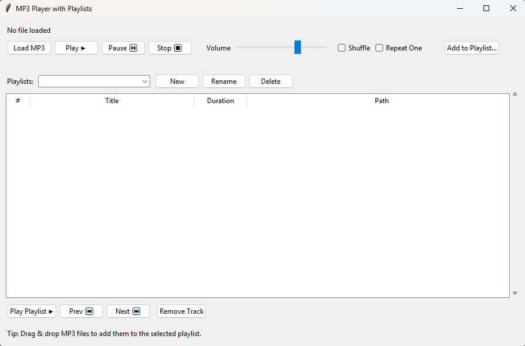
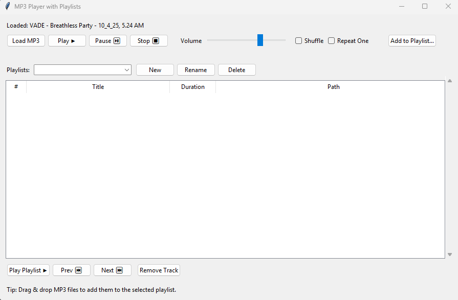
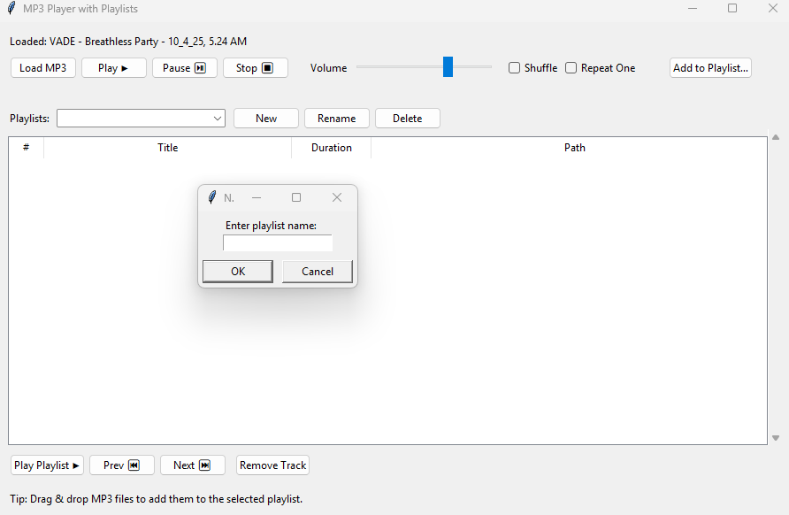
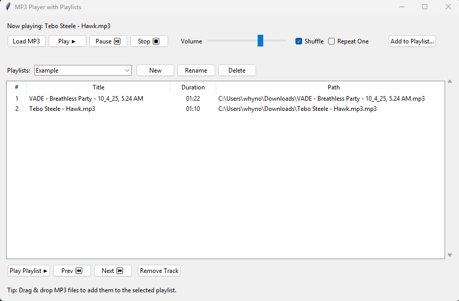

# Python MP3 Player with Playlists:

# Overview:

This project is a desktop MP3 player with a built in playlist management system. The project was developed in Python using libraries Tkinter for the graphical interface and Pygame for audio playback. It allows users to load individual songs, create and manage playlists, and enjoy advanced features within the application such as shuffle, repeat, drag-and-drop support, metadata-based titles (Title – Artist), and duration display of the song being played. The application uses JSON files for data persistence with user playlists so they remain available and load across sessions. 

# Features:
-	This project allows users to play MP3 files directly from their computer.
-	The project has built in playlist management, allowing users to: create, rename, delete, and persist playlists.
-	Tracks can be added manually via searching through folders or via drag-and-drop.
-	Music player controls: play, pause, stop, next, and previous.
-	Shuffle mode built with history-aware navigation; to avoid playing the same song before all songs on the playlist have been played.
-	Repeat-a-song mode to loop a single track.
-	The program has metadata support to display songs as “Title – Artist” when tags are available.
-	Displays the duration of a track in MM:SS format.
-	Persistent storage: Playlists are saved to playlists.json for reuse and allows the user the ability to load and save multiple playlists.
-	The project has a built in adjustable volume controller via a slider, that only affects the songs being played on the music player application .

# Current Finished Product Images:

### Main Menu

### Song Loaded - Not Added To Playlist

### New Playlist Creation

### Playlist With Songs

## Technologies Used:
-	Python 3.11
-	Tkinter – GUI framework
-	Pygame – Audio playback
-	Mutagen – Metadata and duration extraction
-	tkinterdnd2 – Drag-and-drop file support
-	JSON – Playlist persistence

# Usage Instructions:

# File Pathway Tree/ File Directory:

/Python-Mp3-Player-With-Playlists/\
│\
| ---  main.py              # Main GUI logic\
| --- player.py            # Pygame-based audio controls\
| ---  playlist_store.py    # JSON persistence for playlists\
| ---  requirements.txt # Holds an easy download of the required library dependency’s downloads\
└── playlists.json       # Auto-generated user playlist(s) (excluded from GitHub)

## Installation & Setup:
1.	Clone this repository/download the project folder. Ensure that Python 3.11 is installed inside of a runnable IDE (Such as PyCharm); open and project folder inside of the IDE.
2.	After that install the additional needed libraries required for the project to run via the terminal command line prompt system:
a.	pip install -r requirements.txt
b.	Requirements included in the file: pygame, mutagen, tkinterdnd2.
3.	Finally, just run the “main.py” script directly.

## How It Works:
### How to play a MP3 File: 
1.	Click the “Load MP3” button.
2.	Select a mp3 compatible file.
3.	The song will now begin to play
4.	To control the song use the Play, Pause, Stop, and Volume controls.
### Managing Playlists
- Create/Rename/Delete playlists with the toolbar buttons found in the playlist creation menu area.
- After creating a new playlist, to add a song to the playlist, click the “Load MP3” button to load an MP3 file, then click the “Add to playlist…” button to add the MP3 file to the selected playlist.
- The program has built in support for users to drag & drop MP3 files into the window to add them.
- If you no longer want a track in a playlist, use the “Remove Track” button to remove the selected track and delete it from the playlist.
### Playing a Playlist & Other Buttons
1.	Select a playlist from the dropdown menu, or create a new one and add songs to the playlist.
2.	Then click the “Play Playlist” button.
3.	Use the Next/Previous buttons for song navigation. (Or use any of the other song control buttons to play, pause, stop, or change the volume of the songs).
4.	Toggle the checkmark boxes of Shuffle or Repeat One as desired to enable/disable the desired functions.
### Playlists Data Persistence and Saving/Loading
•	All playlists and tracks are stored in playlists.json.
•	This file is auto-created and then updated each time after you use the application.

# Contributing To the Codebase:
Contributions are welcome! Feel free to fork or download this project, modify the code to fix bugs or implement any additions you can think of that fits the project, and submit pull request(s). Please keep all pull requests focused, well-documented, and aligned with the project style.
